# 🏦 Secure Banking Core System

**Enterprise-grade financial ecosystem engineered with Java 17 & Spring Boot 3.**

The **Secure Banking Core System** is a high-availability, modular monolith designed with a microservices-ready mindset. It leverages industry-standard tools for identity management, asynchronous messaging, and full-stack observability.

---

### 🛠️ Technology Stack & Engineering Tools

**Core Development**
[](https://www.oracle.com/java/)
[](https://spring.io/projects/spring-boot)
[](https://maven.apache.org/)

**Security & Identity Management**
[](https://www.keycloak.org/)
[](https://oauth.net/2/)
[](https://jwt.io/)

**Data Persistence & Caching**
[](https://www.postgresql.org/)
[](https://redis.io/)
[](https://www.liquibase.org/)

**Resilience & Messaging**
[](https://resilience4j.readme.io/)
[](https://www.rabbitmq.com/)

**Full-Stack Observability (LGTM Stack)**
[](https://prometheus.io/)
[](https://grafana.com/)
[](https://www.jaegertracing.io/)
[](https://grafana.com/oss/loki/)

**Infrastructure & Quality**
[](https://www.docker.com/)
[](https://kubernetes.io/)
[](https://www.sonarqube.org/)

**Testing & Validation**
[](https://junit.org/junit5/)
[](https://www.h2database.com/)
[](https://github.com/BatuhanBaysal)
[](https://www.liquibase.org/)

---

## 🚀 Key Capabilities & Tech Stack

* **☕ Core Backend:** **Java 17 (Amazon Corretto)** & **Spring Boot 3.4.2** utilizing Clean Architecture.
* **🛡️ Identity & Access (IAM):** Robust security via **Keycloak (OAuth2/OpenID Connect)**.
* **💾 Persistence & Caching:** **PostgreSQL 15** (ACID) and **Redis** for high-speed caching.
* **📩 Async Messaging:** Event-driven tasks supported via **RabbitMQ**.
* **🔭 Observability Stack:** Prometheus, Grafana, Jaeger (Tracing), and Loki (Logging).
* **🧪 Code Quality:** Continuous inspection with **SonarQube** (Zero Technical Debt).
* **☸️ Orchestration:** Containerized with **Docker Compose** and **Kubernetes**.

---

## 🏛️ Architecture & Design Philosophy

The system is engineered as a **Modular Monolith**, striking the perfect balance between transactional integrity and future scalability.

* **🧩 Strategic Modularity:** Clear domain separation (Auth, Account, Transaction) ensures a smooth microservices transition.
* **⚖️ ACID & Consistency:** We guarantee 100% atomic transaction management, paramount for financial safety.
* **📐 SOLID Foundations:** Business rules are strictly decoupled from infrastructure for long-term maintainability.

---

### 🐳 DevOps: Containerization & Orchestration

This ecosystem is fully containerized, ensuring environment parity from development to production.

#### 📦 Docker Ecosystem
Managed via `docker-compose`, integrating 10+ services including databases, IAM providers, and monitoring tools.
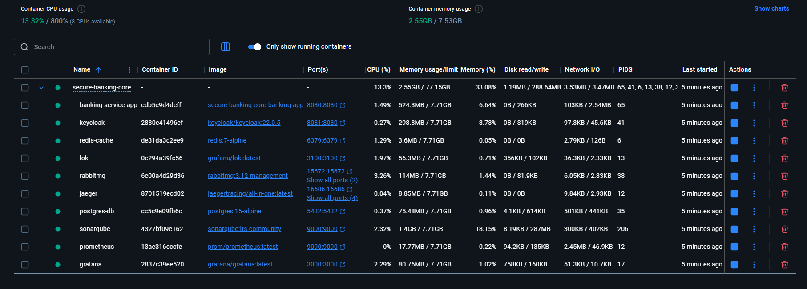

#### ☸️ Kubernetes (K8s) Production Readiness
The project includes complete manifest files for Kubernetes deployment, featuring optimized pod resource management.

> **Engineering Insight:** The K8s configuration supports horizontal scaling and resource limits, ensuring the banking core remains resilient under high load.

---

### 🔭 Full-Stack Observability

We've implemented a comprehensive telemetry suite to monitor every heartbeat of the microservices ecosystem.

#### 📊 Metrics & Performance Visualization
> **JVM & Request Monitoring:** Utilizing **Prometheus** to scrape high-cardinality metrics, we visualize JVM health, memory allocation, and API latency through custom **Grafana** dashboards. This provides proactive insights into system stability.
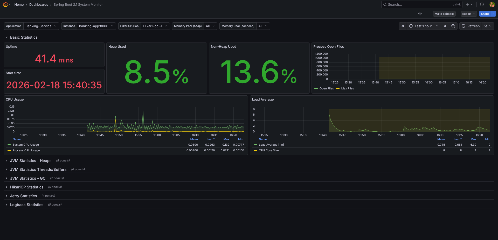

#### 🛰️ Distributed Tracing (OpenTelemetry)
> **Context Propagation:** By integrating **Jaeger**, we perform end-to-end distributed tracing. This allows us to track the lifecycle of a single request across multiple services and databases, making it easy to identify latency bottlenecks in complex transaction flows.
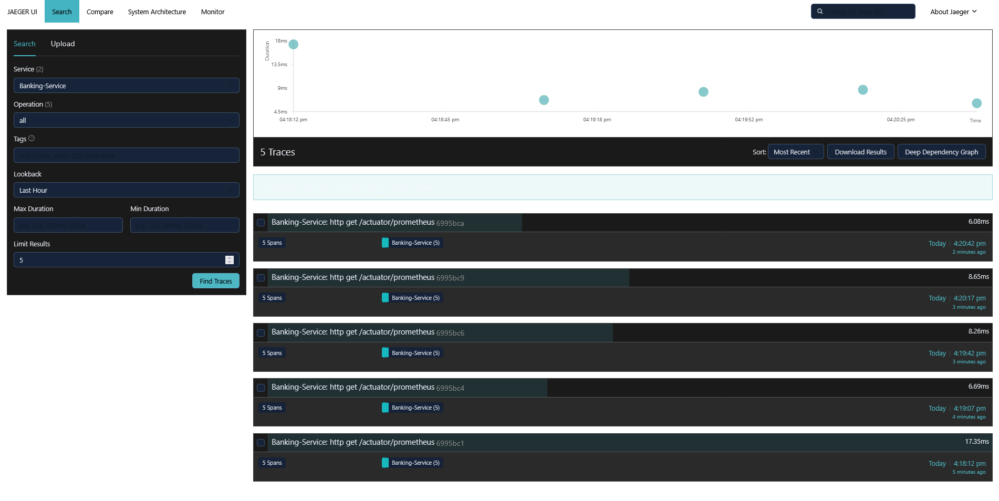

---

### 🧪 Code Quality & Engineering Standards

We maintain a strict **"Zero Technical Debt"** policy. The project's evolution is documented through continuous static analysis to ensure high maintainability and security.

| **Metric** | **Value** | **Status** |
| :--- | :--- | :--- |
| **Bugs & Vulnerabilities** | **0** | ✅ Clean |
| **Code Smells** | **0** | ✅ Optimized |
| **Technical Debt** | **0 min** | ✅ Resolved |
| **Maintainability Rating** | **A** | 🏆 Elite |

> **Refactoring Journey:**
> * 🚩 [**Initial Report (Debt: 4h)**](docs/screenshots/21_sonarqube_initial_report.png): Identification of complex lambda expressions and redundant code smells.
> * 🏆 [**Final Report (Debt: 0m)**](docs/screenshots/22_sonarqube_final_report.png): High-quality code achieved through rigorous refactoring and unit test optimizations.

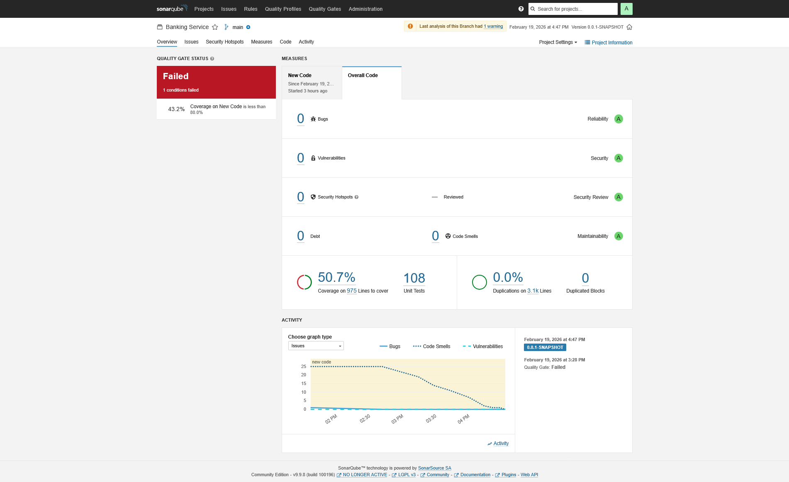

---

### 💾 Database Management & Migrations

#### 🔄 Schema Evolution with Liquibase
We use **Liquibase** for version-controlled database schema changes. This ensures that every environment (Dev, Test, Prod) is perfectly synchronized with the Java entities without manual SQL execution.
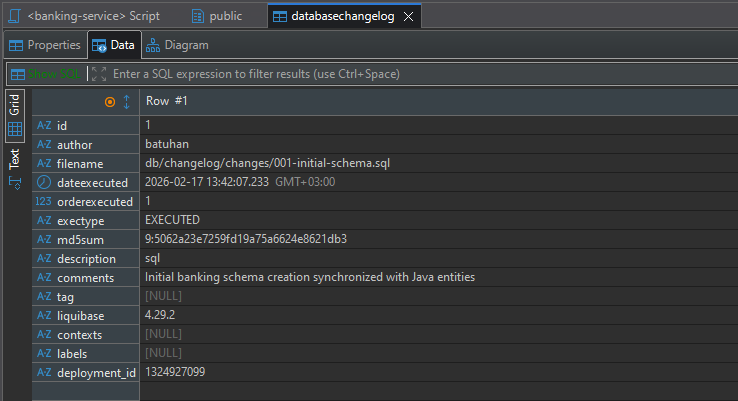

#### 🔍 Complex Query Testing (DBeaver)
Before implementation, complex SQL queries—such as high-activity sender monitoring and anti-fraud filters—are rigorously tested for performance and logic accuracy.


---

### 📩 Messaging & System Health

#### 🐇 Asynchronous Messaging (RabbitMQ)
Transactional emails and background tasks are managed via **RabbitMQ**. This asynchronous approach decouples core banking logic from notification services, improving system responsiveness.
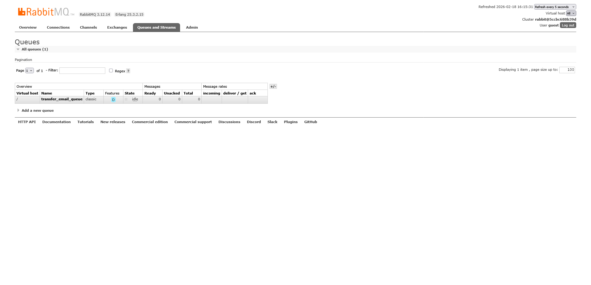


#### 🩺 Deep Health Checks (Spring Boot Actuator)
Beyond simple "UP/DOWN" status, we monitor the health of every integrated component (Postgres, Redis, RabbitMQ) through custom Actuator endpoints.
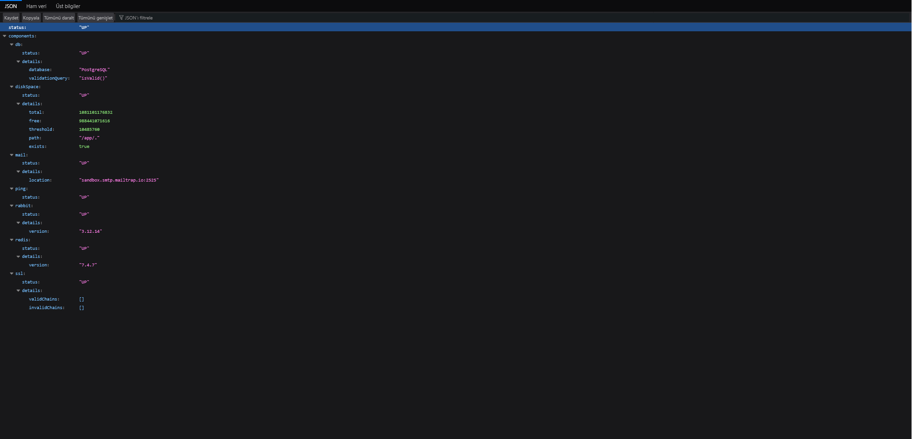

---

### 🔭 Observability: Under the Hood

#### 📝 Centralized Logging (Grafana Loki)
We use **Loki** to aggregate logs from all microservice containers. Its metadata-indexing approach allows us to correlate logs with Prometheus metrics instantly without the heavy overhead of a full ELK stack.
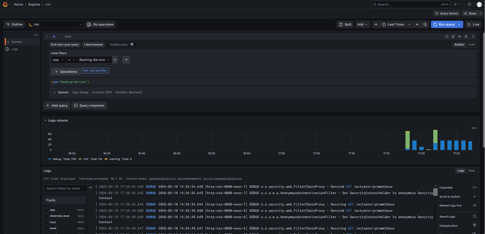

#### 📊 Raw Metrics (Prometheus)
While Grafana provides the visuals, **Prometheus** handles the raw time-series data, scraping `/actuator/prometheus` endpoints to capture every system event and JVM metric.
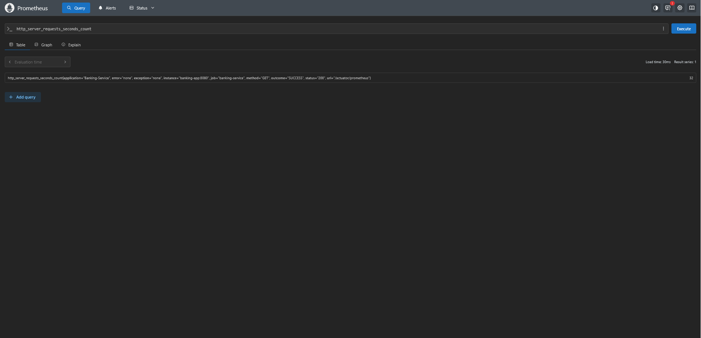

---

### ☸️ Kubernetes Local Development
The project is tested on a local 1-node cluster using **Docker Desktop Kubernetes (v1.34.1)** with **Kubeadm**, ensuring that all manifests (Secrets, PVCs, Deployments) are cloud-ready.
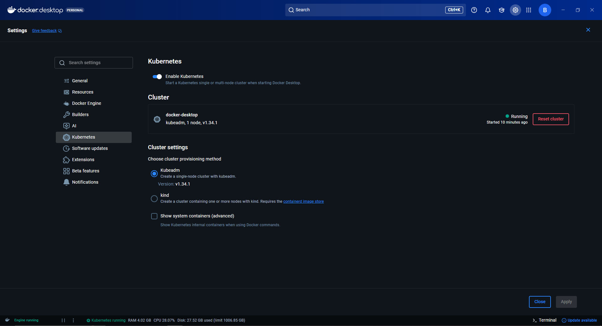

---

### 💡 Engineering Decisions & Evolution

#### 🔐 Security: Transition to Keycloak (IAM)
The system evolved from a custom JWT implementation to **Keycloak**. This transition ensures enterprise-grade **Identity and Access Management (IAM)**, providing robust Role-Based Access Control (RBAC) and SSO capabilities.

#### 🪵 Logging Strategy: Why Grafana Loki?
**Loki** was strategically chosen over ELK for its **resource efficiency**. It indexes only metadata, leading to significantly lower storage costs and a lightweight footprint suitable for high-scale microservices.

---

### 🚀 Future Roadmap & Scalability

The architecture is designed to evolve alongside business needs:

* 🏗️ **Microservices:** Extracting modules into independent services using **Spring Cloud (Eureka, API Gateway)** as load increases.
* 🏗️ **Frontend:** Modern SPA Dashboard using **React.js** & **Tailwind CSS**.
* 🏗️ **Messaging:** Transitioning from RabbitMQ to **Apache Kafka** for high-throughput streaming.
* 🏗️ **CI/CD:** Multi-stage deployment pipelines using **GitHub Actions**.

> [!NOTE]
> **Design Choice:** A Modular Monolith approach was preferred over Microservices for the initial phase to guarantee absolute transactional consistency and avoid network latency, while strictly following **DDD** to ensure a painless split in the future.

---

### 📖 Deep Dive into Backend
For granular details on **Database Schema**, **Design Patterns**, and **Unit Testing (100+ Tests)**:

👉 [**Technical Backend Documentation (BACKEND-README.md)**](./backend/BACKEND-README.md)

---

### 💾 Installation & Setup
Follow these steps to orchestrate the entire ecosystem on your local machine:

#### 1. Clone the Repository

   ```bash
   git clone https://github.com/BatuhanBaysal/secure-banking-core.git
   cd secure-banking-core
   ```


#### 2. Environment Configuration: Create a .env file in the root directory. This file centralizes all secrets for Docker Compose. Use the following template:

> [!NOTE] Ensure that the values in your .env file match the configurations in docker-compose.yml.

   ```bash
   # Database Configuration
   DB_USERNAME=your_db_username
   DB_PASSWORD=your_secure_password
   
   # Security & IAM
   KC_CLIENT_SECRET=your_keycloak_client_secret
   
   # Mail Server (SMTP)
   MAIL_USERNAME=your_smtp_user
   MAIL_PASSWORD=your_smtp_password
   
   # Static Analysis (SonarQube)
   SONAR_DB_USER=your_username
   SONAR_DB_PASSWORD=your_secure_password
   SONAR_TOKEN=your_sonarqube_token
   ```


#### 🐳 3. Deploy with Docker

   ```bash
   1. Build and Start the Entire System (Initial Setup):
      docker compose up -d --build
   
   2. Start Infrastructure Services (Database, Cache, and Message Broker):
      docker compose up -d postgres-db redis-cache rabbitmq sonarqube

   3. Start Identity and Access Management (Security):
      docker compose up -d keycloak

   4. Start Application and Observability Stack:
      docker compose up -d banking-app prometheus grafana jaeger loki

   5. Check Container Status:
      docker compose ps

   6. Monitor Application Logs (Real-time):
      docker logs -f banking-service-app

   7. Monitor Keycloak Logs (Real-time):
      docker logs -f keycloak

   8. Sonar-qube
      .\mvnw.cmd clean verify sonar:sonar "-Dsonar.login={SONAR_TOKEN}"
   ```

> **Local Infrastructure Orchestration:** This view demonstrates the successful deployment of the entire development ecosystem via docker-compose. It confirms that all 10+ integrated services—including Keycloak, SonarQube, Grafana, and the core databases—are in a "Healthy" state. This ensures environment parity and proves that the system's resource allocation is optimized for a local developer machine.


#### ☸️4. Deploy with Kubernetes

   ```bash
   $ kubectl create namespace banking
   $ kubectl apply -f k8s/
   $ kubectl get pods -n banking
   $ kubectl get svc -n banking
   $ kubectl logs -f deployment/banking-service -n banking
   ```

> **Cluster Readiness & Pod Lifecycle:** These logs verify that the Spring Boot application has successfully initialized within a Kubernetes Pod using the prod profile. It documents the successful connection to the managed database and the execution of schema validations. This proves that the containerized application is fully compatible with K8s orchestration, including proper handling of startup probes and environment-specific configurations.
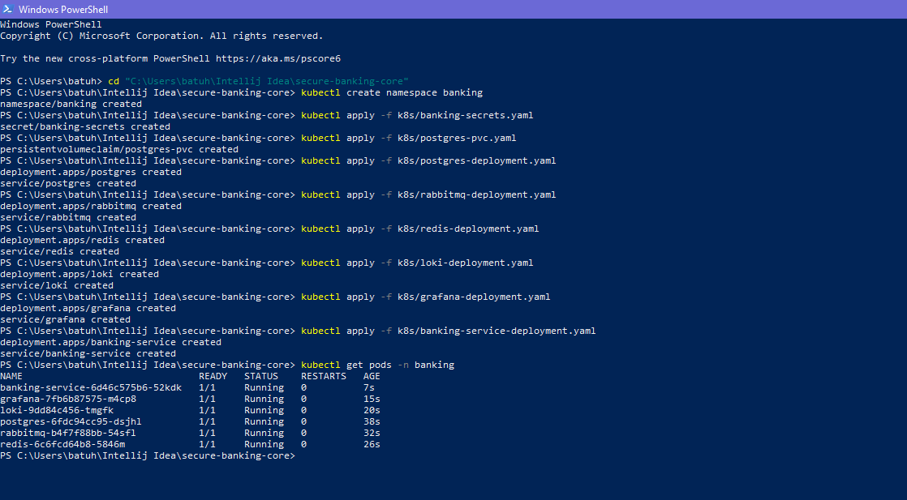

> **Service Discovery & Networking:** This listing showcases the active Kubernetes services within the banking namespace. It validates the networking strategy, where critical infrastructure like Postgres, Redis, and RabbitMQ are kept secure via ClusterIP, while the Banking API and Grafana are exposed via NodePort. This confirms the project's readiness for high-availability production environments.
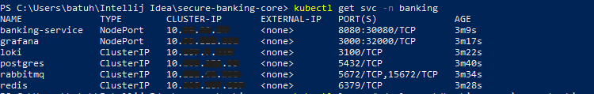


#### 🌐 5. Service Access Points

Once the system is orchestrated, you can access the various banking services and monitoring tools via the following URLs:

| Service | Category | Local Access URL | Port (K8s) | Description |
| :--- | :--- | :--- | :--- | :--- |
| **Banking API** | Core | `http://localhost:8080` | `30080` | Main Banking Logic & REST Endpoints |
| **Swagger UI** | Docs | `http://localhost:8080/swagger-ui.html` | - | Interactive API Documentation |
| **Keycloak** | Security | `http://localhost:8081` | - | IAM & Identity Management Console |
| **Grafana** | Observability | `http://localhost:3000` | `32000` | Metrics & Health Dashboards |
| **Prometheus** | Monitoring | `http://localhost:9090` | - | Time-series Metrics Database |
| **Jaeger UI** | Tracing | `http://localhost:16686` | - | Distributed Request Tracing |
| **Loki** | Logging | `http://localhost:3100` | - | Centralized Log Aggregation |
| **SonarQube** | Quality | `http://localhost:9000` | - | Static Code Analysis Dashboard |
| **RabbitMQ** | Messaging | `http://localhost:15672` | - | Management Console (guest/guest) |

---

### 👨‍💻 Developed & Maintained by
**Batuhan Baysal** - *Software Developer*

[](https://linkedin.com/in/batuhan-baysal)
[](https://github.com/BatuhanBaysal)